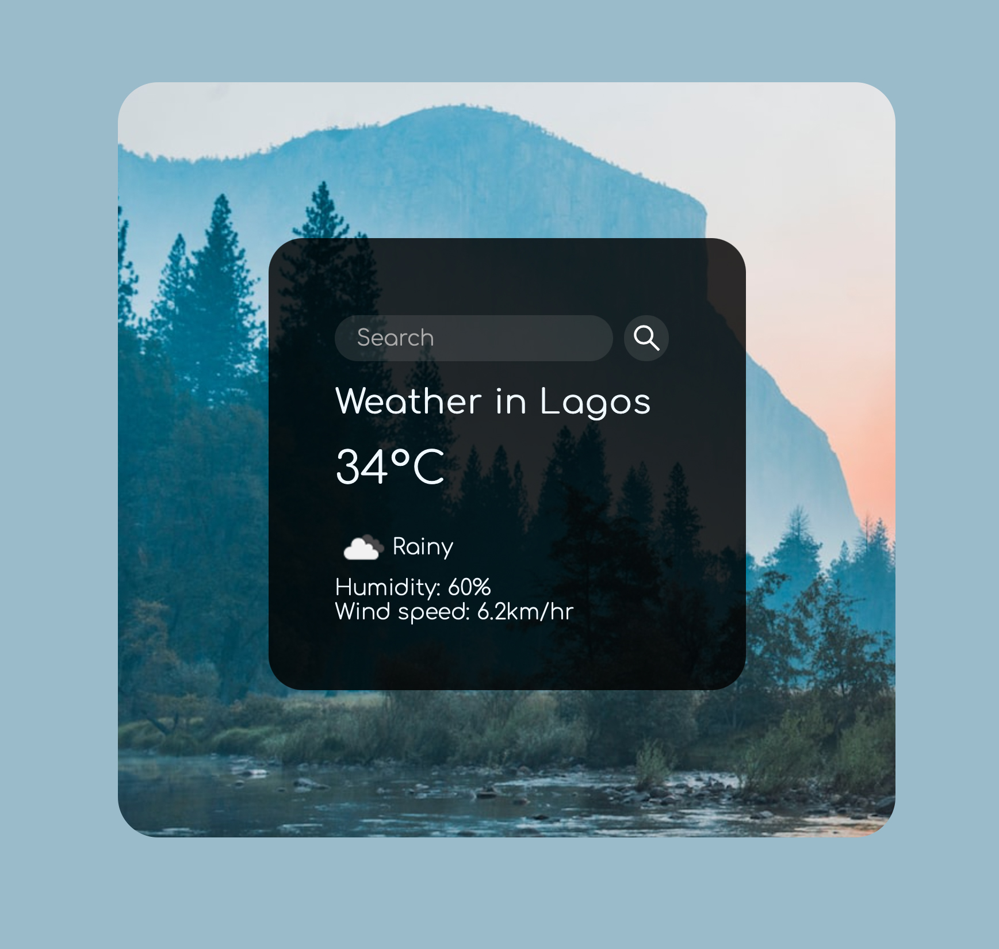

# Weather App

## Description:
This project is a web app that uses web API and user input data to dynamically update the UI in the weather application. 

## Usage:
The web page is usable across all modern browsers.

## Dependencies
index.html style.css script.js
